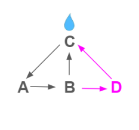
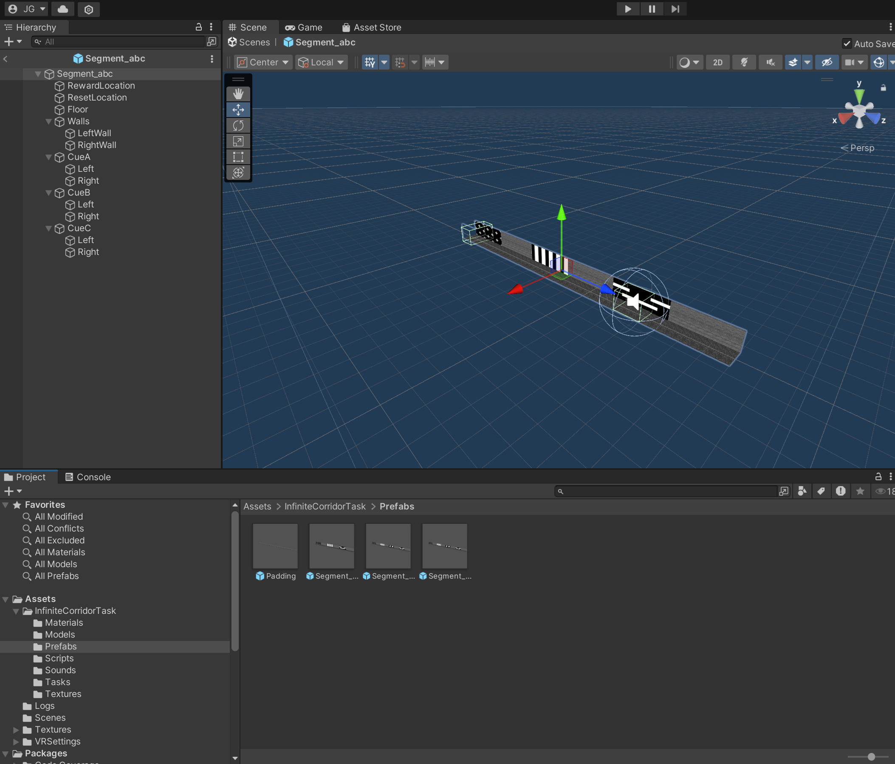
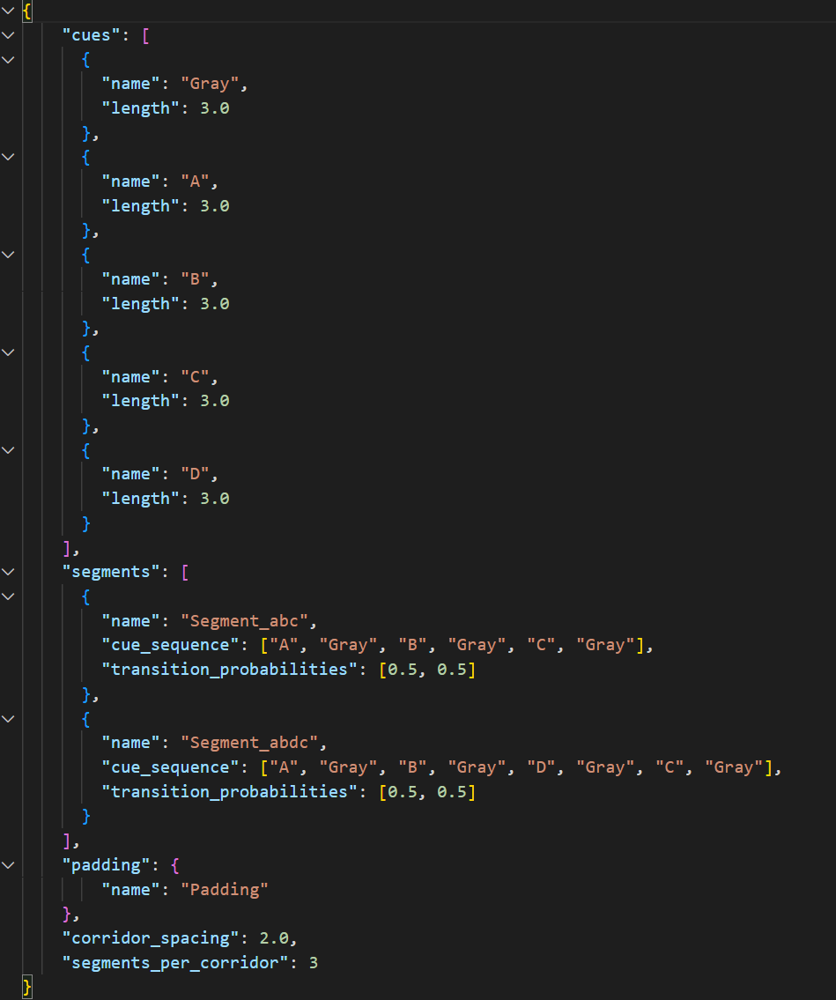
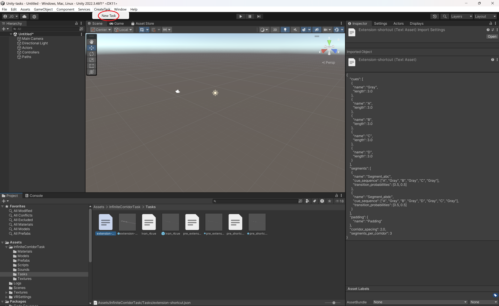

# Unity-Tasks
A Unity project for making infinite corridors for virtual reality mouse experiments. 

## Detailed Description

This repository contains the files necessary to display an infinite corridor to a mouse running on a linear treadmill. Treadmill movement is inputted to the system via MQTT channels, and the visual ouput is displayed to the mouse via a configurable three screen setup. 

This project is an extension of the GIMBL repository, a more flexible package for creating Unity VR tasks. On top of the GIMBL package, this project contains additional tasks and a simple method for modifying tasks and creating new tasks. A key advantage over the original GIMBL repository is that this repository can make corridors that have probabilistic transitions.

The original GIMBL repository can be found here:
https://github.com/winnubstj/Gimbl
___

## Features

- Supports Windows, Linux, and OSx.
- Compatible with GIMBL
- GPL 3 License.
___

## Table of Contents

- [Dependencies](#dependencies)
- [Installation](#installation)
- [Usage](#usage)
- [Task Creation](#task-creation)
- [Developers](#developers)
- [Authors](#authors)
- [License](#license)
- [Acknowledgements](#Acknowledgments)
___

## Dependencies

See dependencies of https://github.com/winnubstj/Gimbl. No additional dependencies are required.
___

## Installation

1. Follow all steps from the [Install Instructions](https://github.com/winnubstj/Gimbl?tab=readme-ov-file#install-instructions) section of the original GIMBL repository. Most importantly, install the MQTT broker.

1. If you haven't already, install the [Unity hub](https://unity.com/download).

1. Clone this repository.

1. From the Unity Hub, select add project from disk and navigate to the local folder containing this repository.   

1. If the correct Unity version is not installed, then there will be a warning next to the project name in the Unity Hub. Click on the warning and install the recommended Unity version.   

After these steps, the created Unity project should compile and run without errors.

___

## Usage

1. When opening the Unity Project you should see the a host of GameObjects in the hierarchy window including Actors, Controllers, and Paths. You may also see some errors in the console. Additionally, you should see tabs next to the inspector with names Settings, Actors, and Displays. If you do not see these tabs, you can reactivate them by selecting Window -> Gimbl.    

1. Create a new scene by clicking File -> New Scene. Instead of using the default scene template, select ExperimentTemplate. Save this scene in Assets/Scene.

1. Follow the [Setting Up the Actor](https://github.com/winnubstj/Gimbl?tab=readme-ov-file#setting-up-the-actor) section from the original GIMBL repository. When creating the controller, choose Linear Treadmill instead of Simulated Linear Treadmill. The Simulated Linear Treadmill is useful for testing but when actually running the experiment you want the Linear Treadmill because it responds only to MQTT messages.

1. Navigate to Assets/UI-lick-reward. Drag the UI-control prefab into the hierarchy window. This adds some visual effects which give the experimenter more information on the mouse's behavior without changing the display as presented to the mouse.

1. Navigate to Assets/InfiniteCorridorTask/Tasks. This folder contains Unity prefabs of different tasks. Drag the prefab for the task you want to run into the hierarchy window. The prefab should become visible in the scene. Make sure you don't drag the prefab directly into the scene because then its position in the scene will be off relative to the virtual mouse. If there already was a prefab for a different task in the scene, make sure to remove it so that the scene has exactly one task.   

1. Select the task GameObject in the Hierarchy window and then view the Inspector window. You will see that the GameObject has a Task script, and there are a host of configurable parameters. You must set the actor to an actor object. You may also modify other parameters.
    - Must Lick - whether or not the mouse has to actually lick to get the reward. If deselected, the mouse gets the reward by just entering the reward region.
    - Visible Marker - whether or not the mouse can see the reward location. Could be useful for testing or pretraining but should be disabled during experiment.
    - Actor - a link to the actor object representing the mouse. This enables the maze to teleport the mouse to keep the illusion of an infinite corridor.
    - Track Length - how much track is pregenerated and logged. This is relevant for tasks with random transitions. If the mouse traverses this length, the task continues with on the fly decisions about which segment the mouse enters next. Track length is in Unity units, and 1 unity unit is 10cm.
    - Track seed - A seed for the creation of random transitions. This can be useful if you want to run many experiments with the exact same pattern of segments. If set to -1, then no seed is used and transitions are truly random. 
    - Meta_data_path - A path to the meta data file associated with the task. Since the meta_data path is global, if you are using a computer that the task wasn't created on, this path will be invalid. To fix this, you can manually change this field or recreate the task. [Task Creation](#task-creation) explains the purpose of meta data files and how to create a task.

1. Verify that the the VR screens are actually displaying the corridor. If it is not, go back to the display window and click on Show Full-Screen Views. If the display is off, you may need to reconfigure the cameras to the proper monitors or press Refresh Monitor Positions. 

1. Press the play button to run the experiment. Verify that There are no errors displayed in the console window. If there are errors, start debugging by looking at the first error printed, which is likely the true error, while the other errors are just a result of running a broken game loop.

___

## Task Creation

The key feature of this repository is the task creator, a system for quickly making any infinite corridor with probabilistic transitions. 

### Specification

A task is specified by segments and the transition probabilities between then. Each segment is split into cues, which are portions of the wall which have different colors/textures. Any cue graph can be represented by a set of segments. For example, the cue graph below can be represented by two segments, between which there are uniform transition probabilities.

Segment 1: A B C 

Segment 2: A B D C

There are additional parameters for a task specification, including:

- Length of each cue
- Length of gray regions
- Cue patterns
- Wall patterns
- Floor patterns
- Reward Locations

### Implementation

To actually create a task and realize a specification, you need to make two things: a Unity prefab for each segment and meta data json file. The simplest way to create these is by starting with already existing examples and making modifications to them as needed.

#### Segment Prefabs

All segment prefabs must be placed in the directory Assets/InfiniteCorridorTask/Prefabs. Double clicking on a prefab opens up Unity's prefab editor. You know you are editing the prefab and not a GameObject when you see a blue background in the scene.

Two key components of the prefab are the reward location and the reset location. The mouse recieves a reward if they lick in a reward region. This lick message must be transmitted to Unity over the MQTT protocol. However, after successfully triggering a reward, the mouse must pass through a reset location in order to get any more reward.

Once you have created a prefab for each segment, you need to make an additional prefab for padding. This should just be a long empty corridor. The padding prefab is used during task creation to give the illusion that the corridor is infinite.

#### Meta Data Json File
The task meta data file, also referred to as the maze specification file, ties the segment prefabs together and is requisite for creating and running tasks. The structure of such a file is shown below. This structure should be matched exactly.

- **cues** — *array\<Cue>*
  - Master list of all cues from any segment.
  - The order of this list determines the integer id's assigned to each cue during logging.
  - **Cue**
    - **name** *(string)* – Unique label for the cue (e.g., `"A"`, `"Gray"`).  
    - **length** *(number, Unity units)* – How much wall space the cue takes up.

- **segments** — *array\<Segment>*
  - List of all segments.
  - **Segment**
    - **name** *(string)* – Name of the segment prefab (e.g., `"Segment_abc"`). Must match the file name in Assets/InfiniteCorridorTask/Prefabs.
    - **cue_sequence** *(string[])* – Ordered list of cues in segment. The sum of the lengths of the cues in this list must match the total length of the segment prefab.
    - **transition_probabilities** *(number[])* – Probabilities of choosing each possible successor segment. Probabilities must sum to 1. The length of this array must correspond to the total number of segments. This field is optional; if unspecified, will assume uniform transitions.

- **padding** — *object*
  - Segment with no cues.
  - **name** *(string)* – the name of the padding prefab in Assets/InfiniteCorridorTask/Prefabs.

- **corridor_spacing** *(number, meters or units)*  
  Distance inserted between consecutive corridors when laying them out in the world.

- **segments_per_corridor** *(integer)*  
  How many segments are concatenated to form one complete corridor. Setting this to 3 is generally sufficient to give the illusion that the corridor is infinite.

Here is an example specification file:

### CreateTask Tab
Once you have created the task specification file, place it in Assets/InfiniteCorridorTask/Tasks. To create the task prefab, select CreateTask->New Task. This will open up a file window within which you can select the meta data json file. It will then open a second prompt allowing you to name and save the prefab. The task prefab can now be put into the scene and [run](#usage).

___

## Developers

* Be careful about modifying segment prefabs. Even after task creation, the task prefab relies on the existence of the segment prefabs. This means that if you modify the segment prefabs later, it will modify all tasks using that prefab. If you want to make small changes to many tasks, use the same segment prefab multiple times. If you want to make a modification to one task without changing other tasks that use the same prefab, make a new prefab that is a duplicate of the old and modfiy the json meta files accordingly. 

* Most changes to task structure can be implemented by just modifying the segment prefabs. However, be careful if modifying a prefab means that a specification file is no longer correct. The specification file has a lot of information needs to match the prefabs, so it is good practice to double check the specification file after modifying. After modifying it is good practice to recreate the task from the spec file. If you name it the same thing as the original, it will jsut replace the old task prefab.

* The [Usage](#usage) section gives explains how to create a scene t o hold the task. When running multiple experiments from the same computer, it may be cumbersome to have multiple Unity projects or to have one Unity project where you have to switch the active task between experiments. The best practice to create a separate scene for each experiment and then just switch between scenes by double clicking on them. When you want to start a new experiment, you can just open the scene and run. Note that display configurations are scene specific, meaning that you will need to reconfigure the display every time you make a new scene or change the scene name.

* Be very careful when pushing and pulling code with Github. Merging branch conflicts is very difficult with Unity, and will likely force you to just pick which branch to change. Try to avoid merge conflicts and focus on making changes to assets (prefabs) while avoiding making large changes to the scene. Additionally, it is good practice to close the Unity project before pushing/pulling.

* The original GIMBL package does logging from Unity. For this repository, the GIMBL package has logging removed. Log files still get created when running the task, but they are empty. 

* For information on how to send MQTT messages to Unity, look [here](https://github.com/winnubstj/Gimbl/wiki/Example-code-of-MQTT-subscribing-and-publishing).
___

## Authors

- Jacob Groner ([Jgroner11](https://github.com/Jgroner11))
- Ivan Kondratyev ([Inkaros](https://github.com/Inkaros))

___

## License

This project is licensed under the GPL3 License: see the [LICENSE](LICENSE) file for details.
___

## Acknowledgments

- All Sun Lab [members](https://neuroai.github.io/sunlab/people) for providing the inspiration and comments during the
  development of this library.