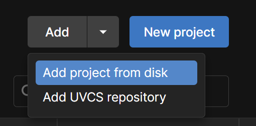
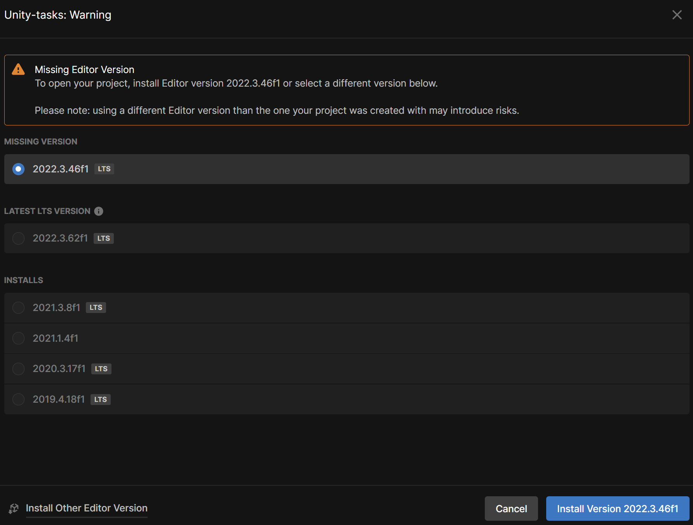
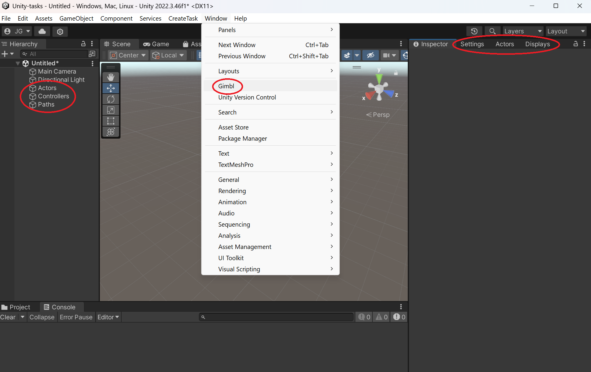
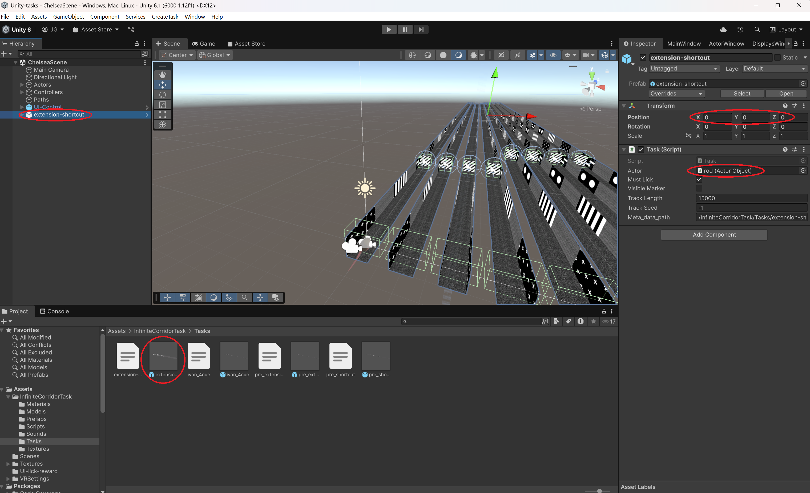
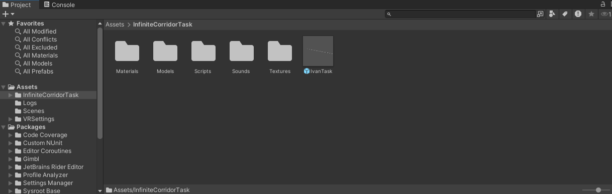
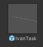
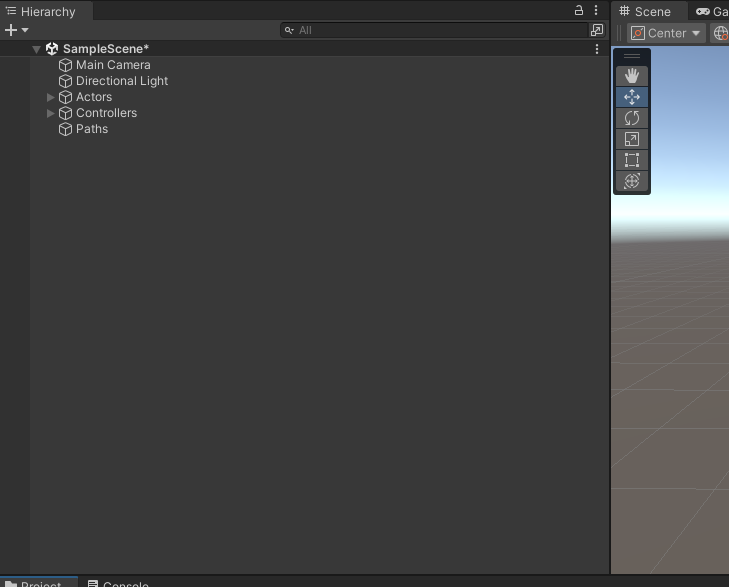
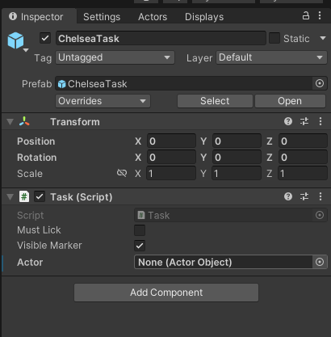
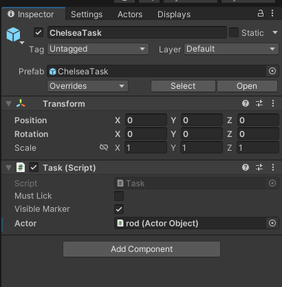
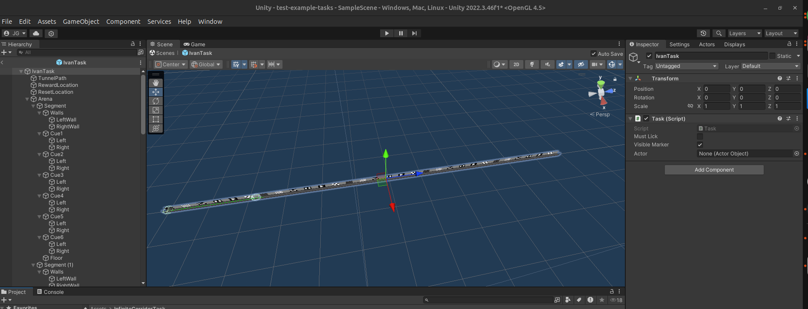

# Unity-Tasks
A Unity project for making infinite corridors for virtual reality mouse experiments. 

## Detailed Description

This repository contains the files necessary to display an infinite corridor to a mouse running on a linear treadmill. Treadmill movement is inputted to the system via MQTT channels, and the visual ouput is displayed to the mouse via a configurable three screen setup. 

This project is an extension of the GIMBL repository, a more flexible package for creating Unity VR tasks. On top of the GIMBL package, this project contains additional tasks and a simple method for modifying tasks and creating new tasks. A key advantage over the original GIMBL repository is that this repository can make corridors that have probabilistic transitions.

The original GIMBL repository can be found here:
https://github.com/winnubstj/Gimbl
___

## Features

- Supports Windows, Linux, and OSx.
- Compatible with GIMBL
- GPL 3 License.
___

## Table of Contents

- [Dependencies](#dependencies)
- [Installation](#installation)
- [Usage](#usage)
- [Developers](#developers)
- [Authors](#authors)
- [License](#license)
- [Acknowledgements](#Acknowledgments)
___

## Dependencies

See dependencies of https://github.com/winnubstj/Gimbl. No additional dependencies are required.
___

## Installation

1. Follow all steps from the [Install Instructions](https://github.com/winnubstj/Gimbl?tab=readme-ov-file#install-instructions) section of the original GIMBL repository. Most importantly, install the MQTT broker.

1. If you haven't already, install the [Unity hub](https://unity.com/download).

1. Clone this repository.

1. From the Unity Hub, select add project from disk and navigate to the local folder containing this repository.   

1. If the correct Unity version is not installed, then there will be a warning next to the project name in the Unity Hub. Click on the warning and install the recommended Unity version.   

After these steps, the created Unity project should compile and run without errors.

___

## Usage

1. When loading the Unity Project you should see the a host of GameObjects in the hierarchy window including Actors, Controllers, and Paths. Additionally, you should see tabs next to the inspector with names Settings, Actors, and Displays. If you do not see these tabs, you can reactivate them by selecting Window -> Gimbl.   

1. Follow the [Setting Up the Actor](https://github.com/winnubstj/Gimbl?tab=readme-ov-file#setting-up-the-actor) section from the original GIMBL repository. When creating the controller, choose Linear Treadmill instead of Simulated Linear Treadmill. The Simulated Linear Treadmill is useful for testing but when actually running the experiment you want the Linear Treadmill because it responds only to MQTT messages.

1. Navigate to Assets/InfiniteCorridorTask/Tasks. This folder contains Unity prefabs of different tasks. Drag the prefab for the task you want to run into the hierarchy window. The prefab should become visible in the scene. Make sure you don't drag the prefab directly into the scene because then its position in the scene will be off relative to the virtual mouse. If there already was a prefab for a different task in the scene, make sure to remove it so that the scene has exactly one task.   

1. Select the task GameObject in the Hierarchy window and then view the Inspector window. You will see that the GameObject has a Task script, and there are a host of configurable parameters. You must set the actor to an actor object. You may also modify other parameters.
    - Must Lick - whether or not the mouse has to actually lick to get the reward. If deselected, the mouse gets the reward by just entering the reward region.
    - Visible Marker - whether or not the mouse can see the reward location. Could be useful for testing or pretraining but should be disabled during experiment.
    - Actor - a link to the actor object representing the mouse. This enables the maze to teleport the mouse to keep the illusion of an infinite corridor.
    - Track Length - how much track is pregenerated and logged. This is relevant for tasks with random transitions. If the mouse traverses this length, the task continues with on the fly decisions about which segment the mouse enters next.
    - Track seed - A seed for the creation of random transitions. This can be useful if you want to run many experiments with the exact same pattern of segments. If set to -1, then no seed is used and transitions are truly random. 
    - Meta_data_path - A path to the meta data file associated with the task. Since the meta_data path is global, if you are using a computer that the task wasn't created on, this path will be invalid. To fix this, you can manually change this field or recreate the task. [Task Creation](#task-creation) explains the purpose of meta data files and how to create a task.

1. Verify that the the VR screens are actually displaying the corridor. If it is not, go back to the display window and click on Show Full-Screen Views. If the display is off, you may need to reconfigure the cameras to the proper monitors or press Refresh Monitor Positions. 

1. Press the play button to run the experiment. Verify that There are no errors displayed in the console window. If there are errors, start debugging by looking at the first error printed, which is likely the true error, while the other errors are just a result of running a broken game loop.

___

## Task Creation

___

Create a GIMBL Unity Project. Do this by following the instructions given in the __Quick Start__ portion of the GIMBL readme, again found here: https://github.com/winnubstj/Gimbl. Specifically, complete the __Import Gimbl into Unity__ and the __Setting up the Actor__ subsections.

Download the .unitypackage file corresponding to the task you wish to run.

Next, complete the __Setting up the task__ portion of the readme. Follow the same instructions in the readme but instead of importing InfiniteCorridorTask.unitypackage, import the downloaded .unitypackage file.

You should now see the prefab object in your assets folder. Just as the tutorial specifies, drag the prefab into the hierarchy window. The prefab will be within a file called "InfiniteCorrridorTask". Make sure you don't drag the prefab directly into the scene because then the task will have some offset. 

Assets tab with prefab:

  

Prefab:

  

Hierarchy Window before and after adding task:

    

The last part of the tutorial involves setting the path of the controller. This may or may not be necessary depending on the specific task, see below.  

### Task Specific Instructions
* __IvanTask_1:__ This task has a tunnel path. Thus, after dragging the prefab into the hierarchy window, you need to set the path of the controller to TunnelPath and turn on the Loop Path parameter. These steps can be done from the Edit dropdown menu of the Controller panel, found in the Actors window. See the __Setting the path__ section from the tutorial.

* __ChelseaTask_1:__ This task does not have a tunnel path. Thus, leave path unspecified and the Loop Path parameter turned off. In order to connect the actor to the path, do the following:

  * In the hierarchy window, click on the task prefab.
  * Click on the Inspector tab.
  * You should see a C# script called Task. This script should have a parameter called Actor. Set the value of this parameter to the actor object

  Inspector Window before and after setting the actor object:

    
  
  Instead of saying "Rod", it will say whatever you named your actor. 

After connecting the actor and the task, you can run the task by pressing the play button. To configure the task for experimental use, you will need to set some additional parameters:

  * Change the controller from a simulated linear treadmill to a linear treadmill.
  * Turn on the Must Lick parameter (see __Change the task parameters__ from the tutorial)
  * Turn off the Visible Marker parameter (see __Change the task parameters__ from the tutorial)

___

## Developers

To modify a task, use a Unity project as a workspace. 

* First follow the above installation instructions to install GIMBL in a Unity project and import the task you want to modify. 

* However, instead of dragging the prefab into the hierarchy window, just double cick on it. This will replace the hierarchy window for the scene with a hierarchy window for the prefab. You will know you are editing the prefab itself and not just a copy of it if the game view has a blue background:
 

* Make any changes to the structure of the maze by modifying this prefab. Make any changes to the control logic of the maze by modifying the Task script.

* Once you're done with the modifications, you can export the modified assets as a new Unity package:
  * In the Project window, select all the assets related to the modified version of the package. (select the InfiniteCorridorTask folder)
  * Right-click on the selected assets and choose Export Package.
  * In the Export Package window, ensure that Include Dependencies is checked (this ensures that all dependent files are included).
  * Choose a location and name for the package and save it to disk. It will be saved as a new .unitypackage
___

## Authors

- Jacob Groner ([Jgroner11](https://github.com/Jgroner11))
- Ivan Kondratyev ([Inkaros](https://github.com/Inkaros))

___

## License

This project is licensed under the GPL3 License: see the [LICENSE](LICENSE) file for details.
___

## Acknowledgments

- All Sun Lab [members](https://neuroai.github.io/sunlab/people) for providing the inspiration and comments during the
  development of this library.